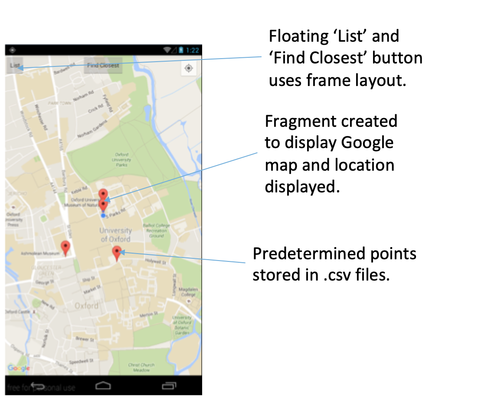
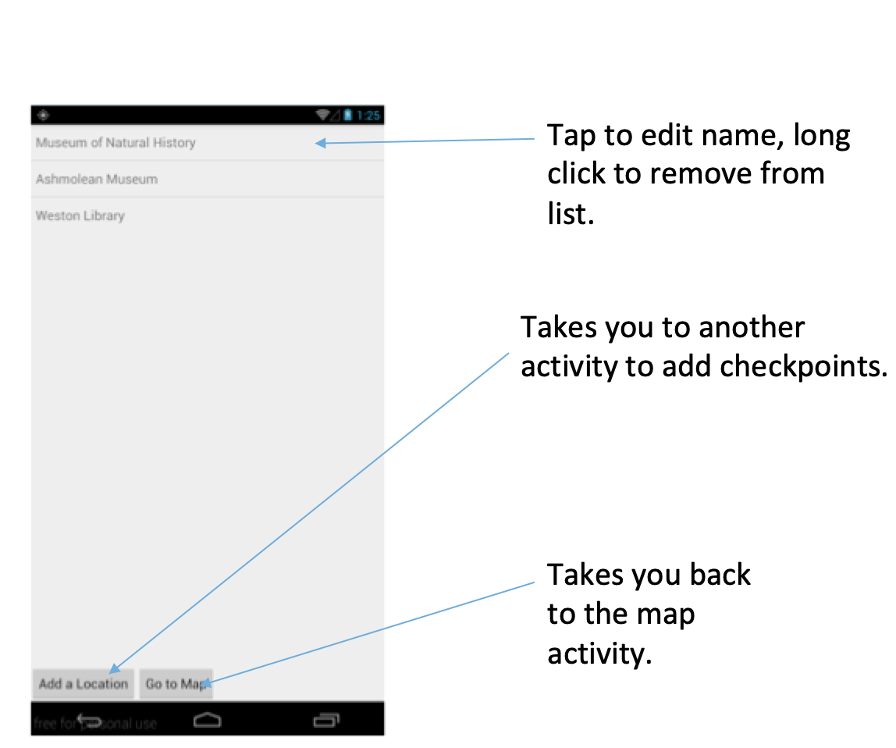

# CheckPoint - An Android Application
Arnold, Matthew, and I designed this simple Android app from scratch in Summer 2016 within 4 days.

## Concept
* This app is designed so that you can explore a city or an area.
* If you have a list of locations you know you want to visit, this app will store that information and display it on a map, as well as tell you when your are near that location.

## Main Map
This part of the app allows you to navigate around an area you don’t know and visit locations that are nearby. It also alerts you when you reach the location you’re looking for.

* Whole app relies on three .csv files containing Names, Latitudes, and Longitudes of locations.
* They are created (if they do not exist) and parsed to plot markers in this activity.
* The distances between your location and the checkpoints are calculated every time your location is updated, and if it is less than 30*m*, the marker is removed, and the entry is deleted from the list.

## List of Checkpoints
This activity stores the locations that you have chosen.

* This activity displays the .csv files in a List view.
* There are *onClick* and *onLongClick* listeners allowing you to edit the elements in the list.
* If the list is edited, then the new .csv files are rewritten when the Add location returns a new location, when going back to the map, and *onPause*.

## Add Location Activity
This activity allows you to pick a new location to visit anywhere in the world. An improvement could be the ability to search within the app and the location that way.

* A long click on the map fragment records the Longitude and latitude of where you hold your finger. This is achieved with a *setOnMapLongClickListener*.
